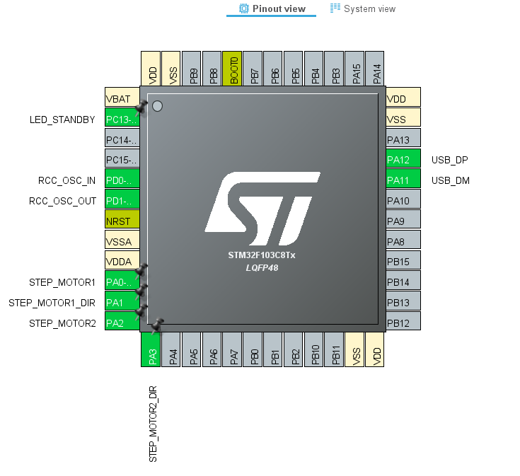
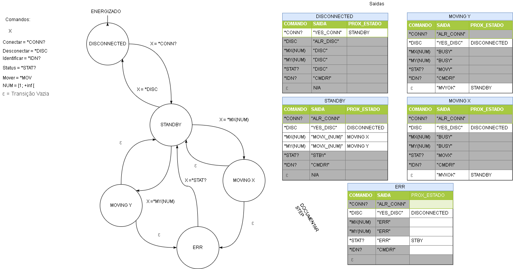

This repository implements the Commander interface for controlling a step motor utilizing EasyDriver and an STM32F103C8T6 Blue Pill Board. 

This has been developed using the [STM32CubeMX IDE by STM](https://www.st.com/en/development-tools/stm32cubeide.html).

The clock configuration is 48MHz. It uses FreeRTOS.

### Pinout

The pinout is configured as follows:

### Implementation

The state machine and commands available as as follow:

Send commands by connecting to the microcontroller through the serial.

Commands for changing step values:

*SSTPX(num)
*SSTPY(num)

Response: the new step for the chosen axis 

Commands for checking step:

*STPX
*STPY

Response: the current step for the chosen axis 